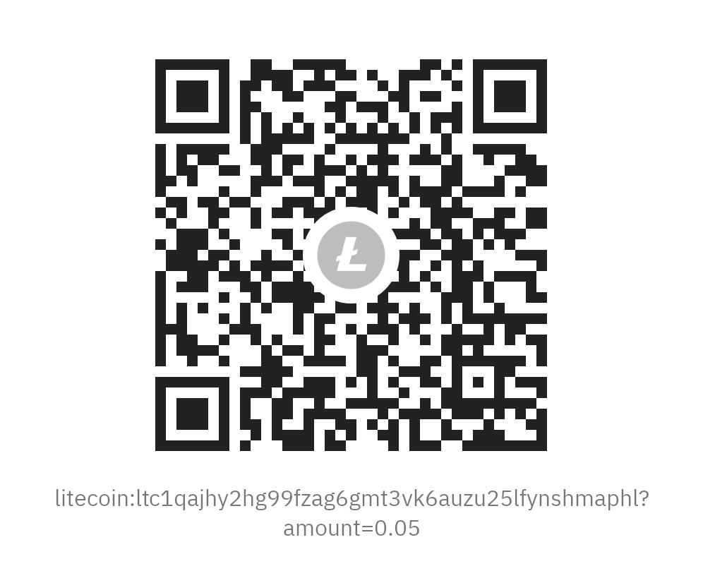

# Yii2 Fastly Cache

Componente de caché Yii2 para Fastly KV Store: solución de almacenamiento en caché perimetral de alto rendimiento.

## Características

- ✅ Integración nativa con Fastly Key-Value Store
- ✅ Caché perimetral de alto rendimiento
- ✅ Compatible con la interfaz estándar de caché de Yii2
- ✅ Configuración simple y directa
- ✅ Soporte para PHP 8.2+
- ✅ Manejo de errores robusto

## Instalación

### Via Composer

```bash
composer require neoacevedo/yii2-fastly-cache
```

## Configuración

### Configuración Básica

Agrega el componente a la configuración de tu aplicación Yii2:

```php
'components' => [
    'cache' => [
        'class' => 'neoacevedo\yii2\fastly\FastlyKvCache',
        'apiToken' => 'TU_FASTLY_API_TOKEN',
        'storeId' => 'TU_FASTLY_STORE_ID',
    ],
],
```

### Configuración Avanzada

```php
'components' => [
    'cache' => [
        'class' => 'neoacevedo\yii2\fastly\FastlyKvCache',
        'apiToken' => 'TU_FASTLY_API_TOKEN',
        'storeId' => 'TU_FASTLY_STORE_ID',
        'keyPrefix' => 'myapp_',
        'defaultDuration' => 3600, // 1 hora
    ],
],
```

### Obtener Credenciales de Fastly

1. **API Token**: Obtén tu token desde [Fastly Dashboard](https://manage.fastly.com/account/personal/tokens)
2. **Store ID**: Crea un KV Store desde el dashboard de Fastly y obtén su ID

## Uso

### Uso Básico

```php
// Guardar datos en caché
Yii::$app->cache->set('mi_clave', 'mi_valor', 3600);

// Obtener datos de caché
$valor = Yii::$app->cache->get('mi_clave');

// Verificar si existe una clave
if (Yii::$app->cache->exists('mi_clave')) {
    // La clave existe
}

// Eliminar una clave
Yii::$app->cache->delete('mi_clave');
```

### Uso con Dependencias

```php
use yii\caching\FileDependency;

$dependency = new FileDependency(['fileName' => 'path/to/file.txt']);
Yii::$app->cache->set('mi_clave', 'mi_valor', 3600, $dependency);
```

### Uso con Tags

```php
use yii\caching\TagDependency;

// Guardar con tags
Yii::$app->cache->set('usuario_1', $userData, 3600, new TagDependency(['tags' => 'usuarios']));

// Invalidar por tag
TagDependency::invalidate(Yii::$app->cache, 'usuarios');
```

## Métodos Disponibles

| Método                         | Descripción                                |
| ------------------------------ | ------------------------------------------ |
| `get($key)`                    | Obtiene un valor de caché                  |
| `set($key, $value, $duration)` | Establece un valor en caché                |
| `add($key, $value, $duration)` | Agrega un valor solo si la clave no existe |
| `delete($key)`                 | Elimina una clave de caché                 |
| `exists($key)`                 | Verifica si una clave existe               |
| `flush()`                      | Limpia toda la caché (no implementado)     |

## Requisitos

- PHP >= 8.2
- Yii2 >= 2.0.54
- Cuenta de Fastly con KV Store habilitado
- Extensión cURL de PHP

## Limitaciones

- El método `flush()` no está implementado debido a las limitaciones de la API de Fastly KV
- Los TTL (Time To Live) son manejados por Fastly, no por el componente

## Contribuir

Las contribuciones son bienvenidas. Por favor:

1. Fork el proyecto
2. Crea una rama para tu feature (`git checkout -b feature/nueva-caracteristica`)
3. Commit tus cambios (`git commit -am 'Agrega nueva característica'`)
4. Push a la rama (`git push origin feature/nueva-caracteristica`)
5. Crea un Pull Request

## Soporte

Si encuentras algún problema o tienes sugerencias:

- 🐛 [Reportar un bug](https://github.com/neoacevedo/yii2-fastly-cache/issues)
- 💡 [Solicitar una característica](https://github.com/neoacevedo/yii2-fastly-cache/issues)
- 📧 Contacto: contacto@neoacevedo.nom.co

## Donaciones

Si este proyecto te es útil, considera hacer una donación:

<div align="center">

| Ko-fi                                                  | Litecoin                                                     |
| ------------------------------------------------------ | ------------------------------------------------------------ |
| [](https://ko-fi.com/neoacevedo) |  |
| ☕ [Ko-fi](https://ko-fi.com/neoacevedo)                | Ł Donaciones Litecoin                                        |

</div>

## Licencia

Este proyecto está licenciado bajo la Licencia GPL-3.0+ - ver el archivo [LICENSE.md](LICENSE.md) para más detalles.

## Autor

**Néstor Acevedo**

- Website: [neoacevedo.nom.co](https://neoacevedo.nom.co)
- Email: contacto@neoacevedo.nom.co

---

⭐ Si te gusta este proyecto, ¡dale una estrella en GitHub!